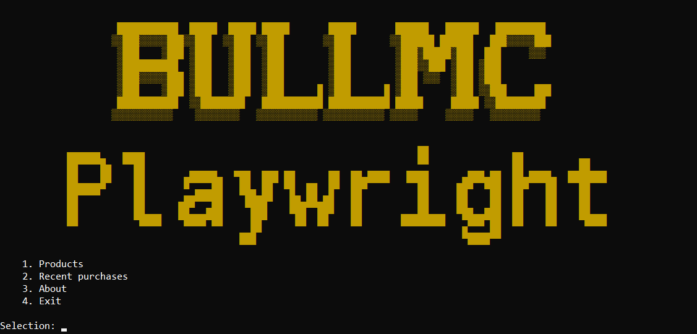
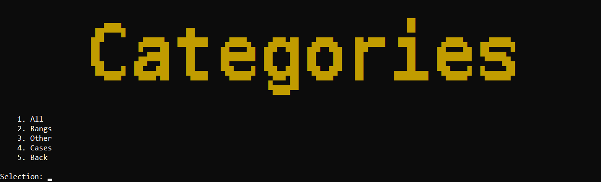
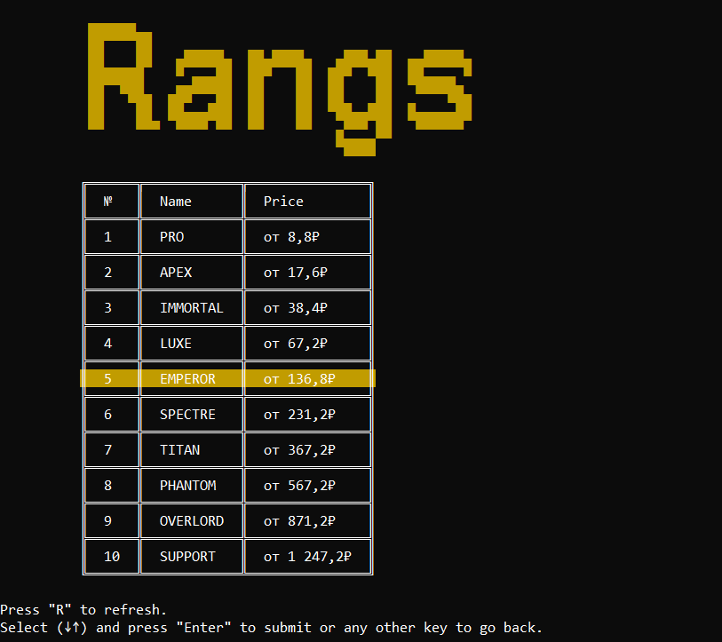
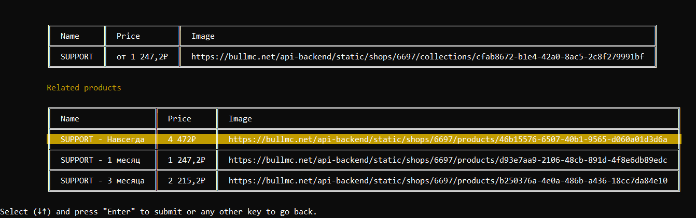
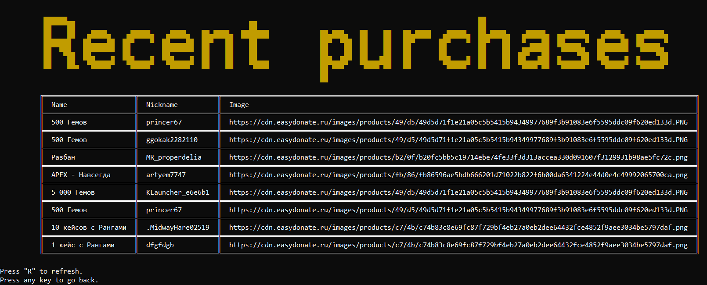

# PlaywrightBull
A C# .NET CLI app using Playwright to scrape the BullMC website (EasyDonate-powered), featuring a handcrafted console UI table.
## Features
- **Resources-based localization**
- **Handcrafted CLI table component**
- **Data caching**
## Localization

|Language|Status|
|:---|:---|
|English|100% ✅|
|Russian|100% ✅|

## Screenshots
<table>
  <tr>
      <td><kbd></kbd></td><td><kbd></kbd></td>
  </tr>
  <tr>
      <td><kbd></kbd></td><td><kbd></kbd></td>
  </tr>
    <tr>
      <td colspan="2" align="center"><kbd></kbd></td>
  </tr>
</table>